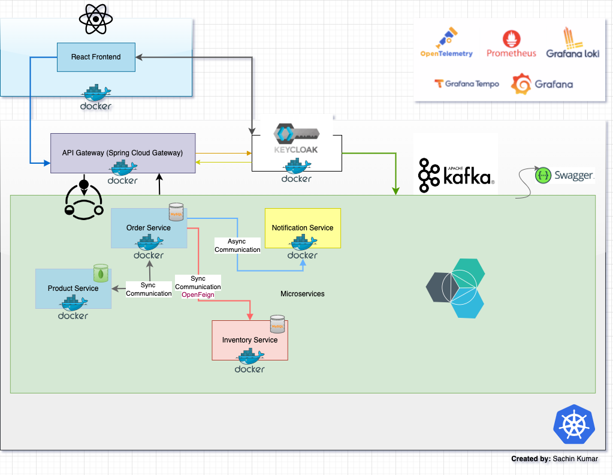
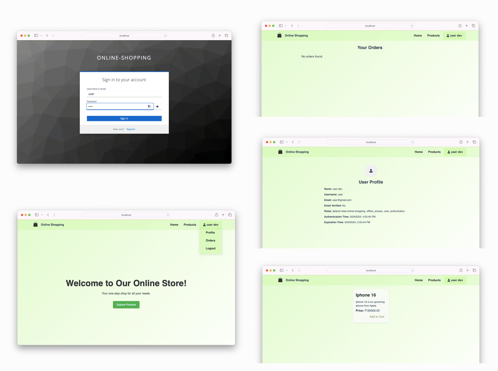

# My Projects

Welcome to my projects repository!
<!-- These projects are not part of any course or tutorial; they are the result of my own exploration and learning journey.My main objective is to learn how things are done in the proper way, how to build a full-stack app from scratch.   -->
Each project here represents a step forward in my quest for deeper understanding of software development.

<!-- --- -->
## 1. Online Shopping Application

<!-- [](https://github.com/ksachin7/microservices-app)   -->
The Online Shopping System is a microservices-based application designed to handle various aspects of an online shopping platform, including product management, order processing, inventory management, and notifications. The project is built using Spring Boot for backend services and React for the frontend.

### Application Architecture

The system is composed of several microservices, each responsible for a specific domain within the application. These services communicate with each other via REST APIs and are managed and deployed using Docker and Kubernetes.


<!-- ### Screenshots -->

<!--  -->

`React` `Axios` `React Router` `Redux` `SCSS` `Styled-Components` `Webpack` `Spring Boot` `Spring Cloud Gateway`  `OpenFeign` `Resilience4J` `Spring Data` `MongoDB`  `Spring Security` `Keycloak` `MySQL` `MongoDB` `Flyway` `docker` `kubernetes` `Swagger` `OpenAPI`

### Future Work

- **Monitoring and Observability**: Integrate Prometheus and Grafana for system performance tracking.
- **Notifications**: Implement Kafka for reliable alerting and notifications.
- **Testing**: Utilize Testcontainers and WireMock for robust backend integration tests, and Jest for comprehensive frontend React unit tests to ensure better coverage and reliability.
- **UI/UX Improvements**: Refine the user interface and experience for better usability and design.
- **Redis**: Use redis for cart and inventory for caching and to improve performance.
- **Payment Service**: Create payment service to manage payments.
- **OTP-Service**: Develop an OTP service for password recovery.
- **Spring Profile**: Utilize Spring profiles for configuration management.

## 2. ExpenseWise

[](https://github.com/ksachin7/ExpenseWise)  
ExpenseWise is an Expense Management System, designed to help users efficiently track their expenses. It provides features for managing expenses, generating reports, and visualizing spending patterns.

### Technologies Used

```markdown
| Frontend                         | Backend                        |
|----------------------------------|--------------------------------|
| React "^18.3.1"                  | Spring Boot 3.3.1              |
| Styled Components: "^6.1.11"     | Spring Security 6.3            |
| React Error Boundary: "^4.0.13"  | Spring Data JPA                |
| React Hot Toast: "^2.4.1"        | spring-boot-starter-validation |
| React Hook Form: "^7.51.5"       | Java 17                        |
| Axios: "^1.7.2"                  | H2 Database                    |
| React Icons: "^5.2.1"            | Lombok                         |
| React Modal: "^3.16.1"           |                                |
| React Router DOM: "^6.23.1"      |                                |
| Recharts: "^2.12.7"              |                                |
```

### Features

- User authentication and authorization using Spring Security.
- RBAC Implementation
- Expense Dashboard
- CRUD operations for managing expenses and users.
- Global Exception Handler
- A Dashboard app with User profile page and admin pannel.
- Data visualization using Recharts.
- Darkmode and lightmode.
- Reusable UI Components.
- Real-time error handling with React Error Boundary.
- Form validation using React Hook Form.
- Toast notifications using React Hot Toast.
- Routing with React Router DOM.
- Styled Components and GlobalStyles for styling.

<!-- --- -->

## 3. React Custom UI, Testing & CICD

[](https://github.com/ksachin7/custom-ui-components)  
 This project is aimed to create reusable UI components using React and styled-components. It includes a variety of components such as buttons, accordions, select dropdowns, spinners, and more. The components are designed to be highly customizable and support dark mode.

### Features

- Reusable UI components
- Built with React and styled-components
- Supports for dark mode
- Unit Testing using Jest and Enzyme
- GitHub Action CICD

## 4. Upcoming Projects

...
